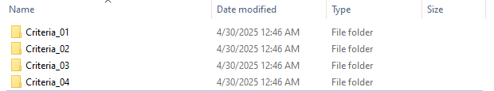
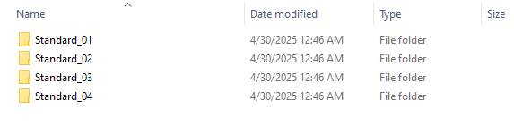
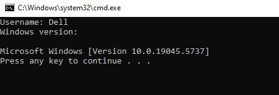
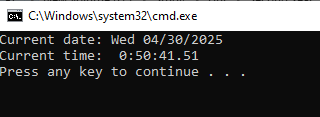
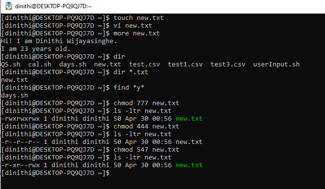

# 📅 2025-03-10 - 🍃 CMD
This folder contains OS practicals from **March 10, 2025**.

## 📜 Lesson Overview  
In this lesson, we learned the following,
- **Create Directories using CMD commands.**
- **Display the username**
- **Display the windows version**
- **Display the current time**
- **Display the current date**
- **Display the age**
---

| Code  | Output |
|------|------|
| [`practical 01`](./Codes/practical01.txt)  |    |
| [`practical 02`](./Codes/practical02.txt)  |  |
| [`practical 03`](./Codes/practical03.txt)  |  |
| [`practical 04`](./Codes/practical04.txt)  |  |
