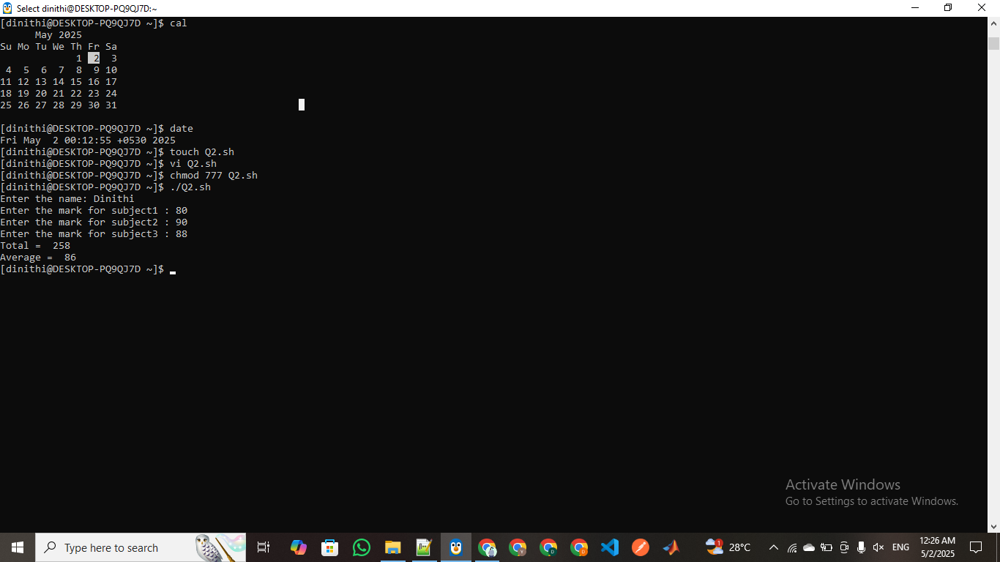
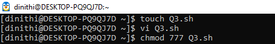
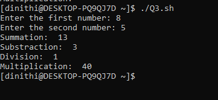
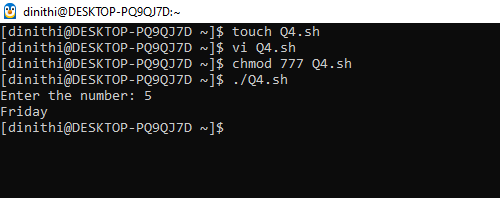
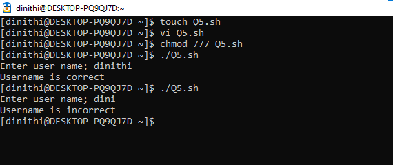
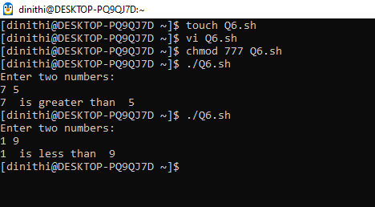
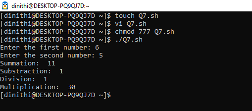

# 📅 2025-03-31
This folder contains OS practicals from **March 31, 2025**.

| Code  | Output |
|------|------|
| [`practical 01`](./Codes/exercise.txt)  | (01)Get the calendar and date. (02)Get the student name and marks for the 3 subjects from user then calculate the total and average.  (03)Create calculator with arithmetic operators.    (04)Get the days based on the user input number.   (05)Verify whether your username is correct or not.  (06)Enter two numbers & print greater one (07)Create simple calculator using "expr" command same as the Question03. |
