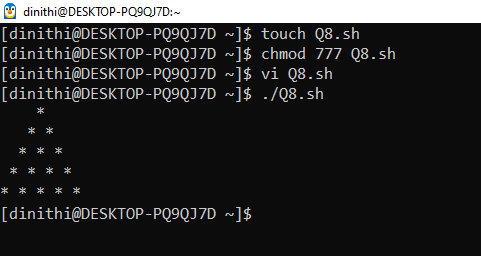

# 📅 2025-04-04

This folder contains OS practicals from **April 04, 2025**.

| Code  | Output |
|------|------|
| [`practical 01`](./Codes/exercise.txt)  | **(01)Write a code for a small astrology program based on your life path number. For that get the date of birth from user & then calculate life path number.(Use switch case).**      **(02)Give list of numbers then calculate the summation and multiplication using for loop.**      **(03)Print the integers from 1 to 10 using while loop.**      (04)Print the below patterns using nested loop.   |
