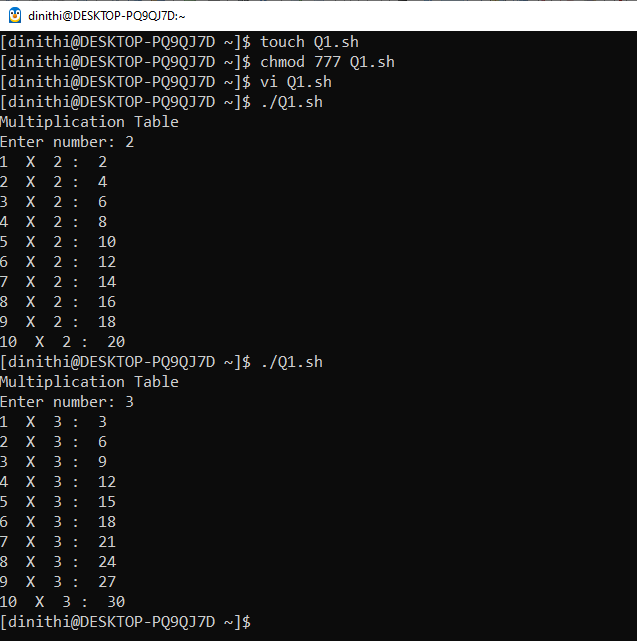
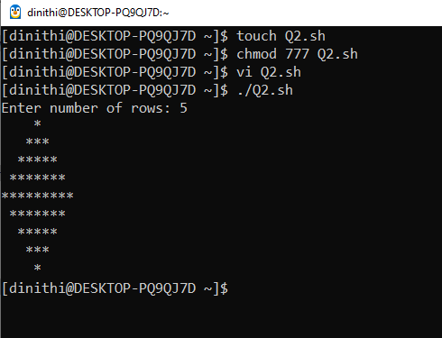
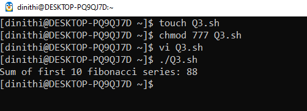
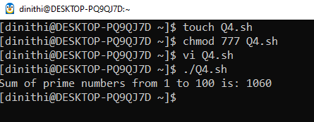

# 📅 2025-04-18

This folder contains OS practicals from **April 18, 2025**.

| Code  | Output |
|------|------|
| [`practical 01`](./Codes/exercise.txt)  | **(01)Print Multiplication table using for loop.**      **(02)Print a pattern**      **(03)Sum of first 10 fibonacci numbers:88.**      **(04)Sum of prime numbers between 1 and 100 is: 1060.**   |
