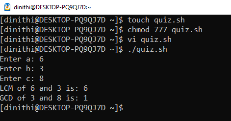

# 📅 2025-04-21

This folder contains OS practicals from **April 21, 2025**.

Quiz 01 :-

Question: **Get the user input for three numbers (a,b,c).Calculate the LCM(Least Common Multiple) for the first two numbers(a,b) and calculate the GCD(Greatest Common Divisor) for the last two numbers(b,c).**

| Code  | Output |
|------|------|
| [`Quiz 01`](./Codes/quiz.txt)  |  |
