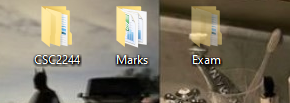
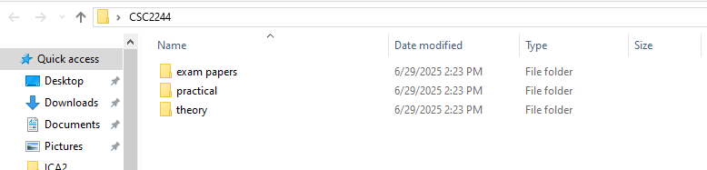
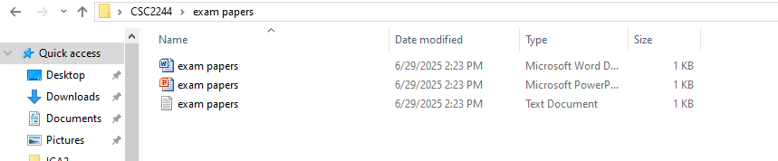
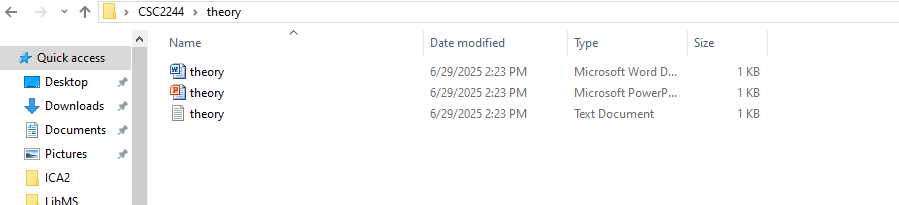
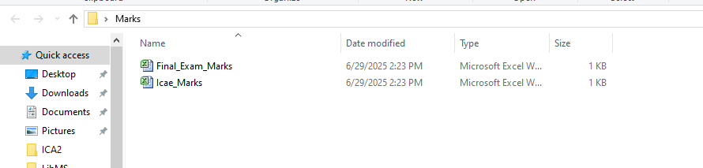
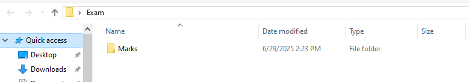
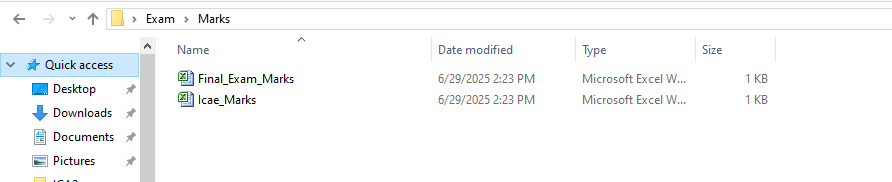
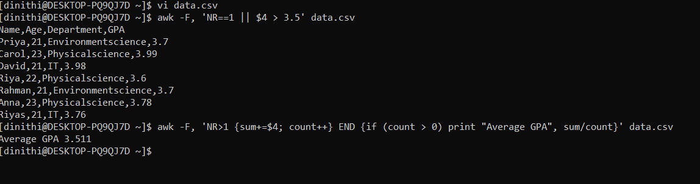
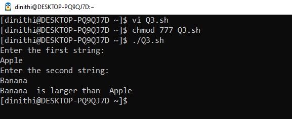

# 📅 2025-04-25

This folder contains ICAE 01 from **April 25, 2025**.

# Question 01

Using Command Prompt on a Windows system, write the exact commands to complete the following tasks:

• Create New directories named CSC2244 , Marks and Exam on your Desktop.

• Inside the CSC2244 directory, create three subdirectories named practical, theory, and exam papers.

• Inside each subdirectories, create a text file, a Word document, and a PowerPoint document respectively.

Eg:
Practical → Word document, PowerPoint document, text file

• Create two new excel files in desktop named Icae_Marks & Final_Exam_Marks. Move those two into the directory Marks.
• Copy the Directory Marks into the Exam directory and hide the Exam directory.

Using bash shell Do the Question 02 and Question 03 Given Below

# Question 02

Using the data.csv file do the questions given below.

1) Filter the rows where the GPA is greater than 3.5
2) Calculate the average GPA of all students.

# Question 03

Read two strings from user.
Count the characters of each string and print the lengthy string as shown below.

Expected output :
Enter the first string:
Apple
Enter the second string:
Banana
Banana is larger than Apple

| Code  | Output |
|------|------|
| [`Question 01`](./Codes/answer1.txt)  |          |
| [`Question 02`](./Codes/answer2.txt)  |  |
| [`Question 03`](./Codes/answer3.txt)  |  |

