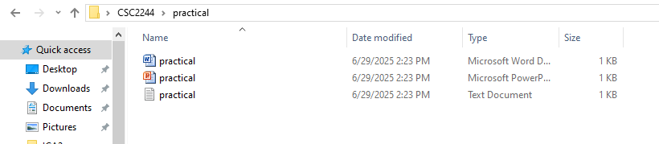

# 📅 2025-04-25

This folder contains OS practicals from **April 25, 2025**.

# Question 01

Using Command Prompt on a Windows system, write the exact commands to complete the following tasks:

• Create New directories named CSC2244 , Marks and Exam on your Desktop.

• Inside the CSC2244 directory, create three subdirectories named practical, theory, and exam papers.

• Inside each subdirectories, create a text file, a Word document, and a PowerPoint document respectively.

Eg:
Practical → Word document, PowerPoint document, text file

• Create two new excel files in desktop named Icae_Marks & Final_Exam_Marks. Move those two into the directory Marks.
• Copy the Directory Marks into the Exam directory and hide the Exam directory.

| Code  | Output |
|------|------|
| [`Question 01`](./Codes/answer1.txt)  |         |
