# 📅 2025-05-02

This folder contains OS practicals from **May 02, 2025**.

| Code  | Output |
|------|------|
| [`Codes`](./Codes/code.txt)  | **(01)Enter your age and verify wether you're eligible or not for election voting using if else condition.**    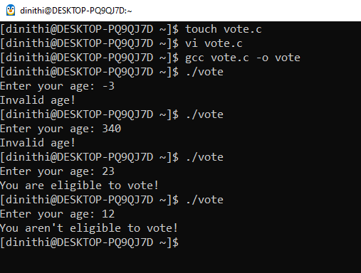   **(02)Enter your age and verify wether you're eligible or not for election voting using ternary operator**   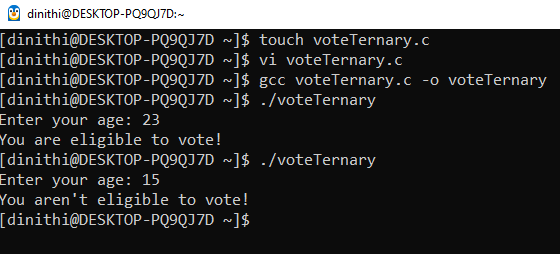   **(03)create a program to find the day using switch case**   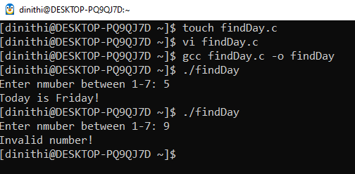   **(04)Find the life path based on the life path number**   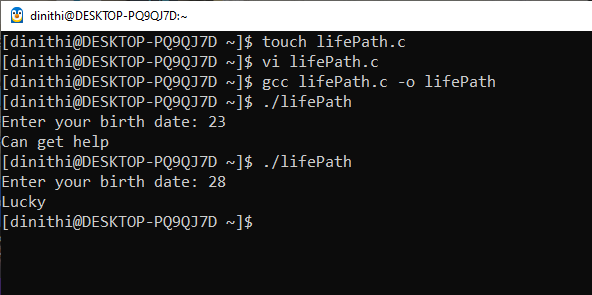   **(05)Find the fibonacci series upto the number of elements user inputs**   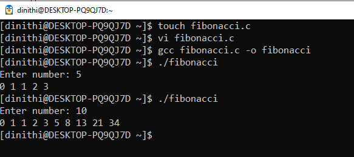   **(06)Factorial for non-negative numbers**   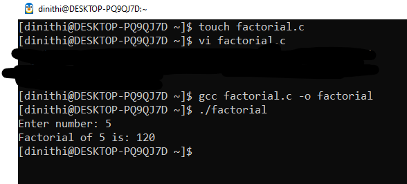   **(07)Print 1-10 using while loop**   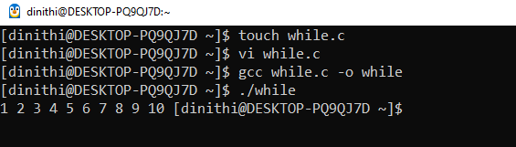   **(08)Write a C program that: Accepts two strings as input from the user,Concatenates the two strings, Displays the concatenated result.**   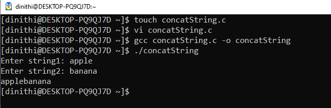   **(09)Write a C program that takes a binary number (as an integer) as input and converts it to its decimal equivalent.**   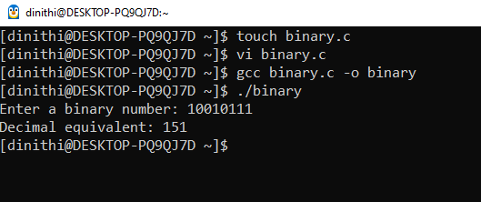   **(10)Write a C program that: Accepts an array of integers from the user. Finds and displays the maximum and minimum values in the array.**   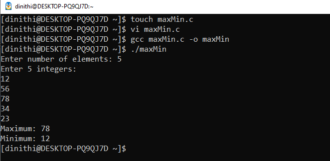   **(11)C program to generate Pascal's Triangle.**   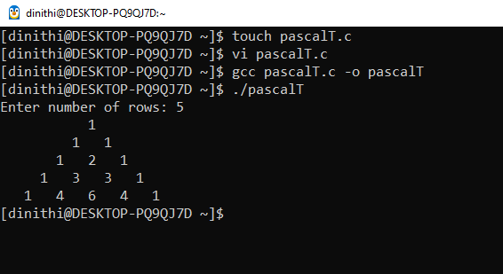|
